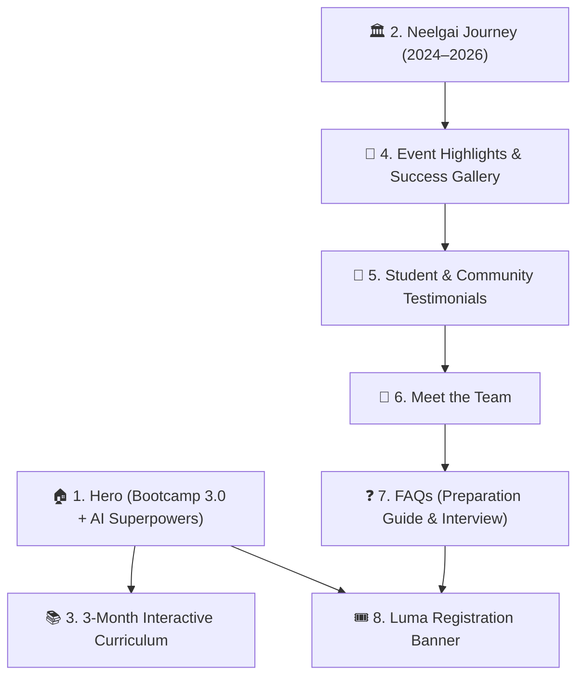

# 🌐 Neelgai Official Website & Bootcamp 3.0 Launch: Complete Blueprint

**Document Purpose:** Comprehensive specification of what to include, what NOT to include, section-by-section copy, team profiles, event gallery structure, testimonials, and Luma registration funnel for the Neelgai website and the 3rd Bootcamp launch.  
**Lead Instructor:** Amardeep Soni  
**Organization:** Neelgai (Janakpur Dham, Nepal)  

---

## 🏛️ 1. Neelgai Organizational Timeline & Social Proof

The website proudly presents Neelgai's journey and community leadership across Madhesh Province:

```
┌────────────────────────────────────────────────────────────────────────────┐
│                        NEELGAI EVOLUTION TIMELINE                          │
├────────────────────────────────────────────────────────────────────────────┤
│ 2024: • 1st Web Development Bootcamp (Full-Stack Engineering)              │
│       • 1st Janakpur Tech Hackathon (Regional Innovation)                  │
├────────────────────────────────────────────────────────────────────────────┤
│ 2025: • 2nd AI/ML Bootcamp (Data Science & Intelligent Systems)            │
│       • 2nd Neelgai Community Hackathon (Build & Ship Sprint)              │
├────────────────────────────────────────────────────────────────────────────┤
│ 2026: • Janakpur AI Summit (Industry Speakers, Keynotes & Tech Gathering)  │
│       • 3rd Full-Stack Web + AI Engineering Bootcamp (CURRENT - WINTER)    │
└────────────────────────────────────────────────────────────────────────────┘
```

---

## 🚫 2. What NOT to Include vs. ✅ What to Include

| Feature / Section | ❌ What NOT to Include | ✅ What to Include Instead |
| :--- | :--- | :--- |
| **Batch Sizes / Metrics** | Do NOT mention student counts or any low enrollment figures from past batches. | Highlight **Event Milestones, Hackathon Winners, Community Impact, and Project Showcase**. |
| **UI & Visual Design** | ❌ **NO Generic AI Look:** Avoid cookie-cutter purple/neon gradient soup, blurry glowing blobs, and standard repetitive AI-template aesthetics. | ✅ **Clean Modern Engineering UI:** Sleek dark/light minimalist palette, crisp typography (Inter/Geist), clean borders/cards (Linear/Vercel/Shadcn style), micro-interactions, and real event photography. |
| **Registration Form** | Do NOT embed an on-page HTML form or custom database form. | Use a direct high-converting CTA button linking to **Luma Event Page (`lu.ma/your-event`)**. |
| **Prerequisites Tone** | Do NOT strictly reject beginner students upfront. | **Encourage Self-Learning:** Guide students to learn basic C/Java logic and HTML/CSS *before* their screening interview (with free resource links in FAQ). |
| **Teaching Approach** | Avoid confusing dual-track or parallel teaching models. | Emphasize **Single Dedicated Instructor (Amardeep Soni)** with sequential, step-by-step full-stack mastery. |
| **Photo Dump** | Don't post unorganized random images. | Use a **Categorized Event Showcase Grid** (Bootcamps, Hackathons, AI Summit). |

---

## 🗺️ 3. Complete Website Architecture (Sitemap)



---

# 📄 4. Section-by-Section Content & Copy Guide

---

### 🌟 SECTION 1: HERO (Above the Fold)
* **Top Badge:** `🚀 Applications Open for Winter Batch (Starts Mid-November)`
* **Main Headline:** **"From Core Programming to Full-Stack Web & AI Engineering."**
* **Sub-headline:** *"Janakpur's premier 3-month practical bootcamp by Neelgai. Master modern responsive UI with Tailwind & React, build robust REST APIs with Python & Django (SQLite), and integrate Generative AI APIs into real-world applications."*
* **Call to Action (CTA) Buttons:**
  * Primary Button: `[ Register on Luma for Screening ➔ ]` *(Links to lu.ma event page)*
  * Secondary Button: `[ View 3-Month Syllabus ]`
* **Trust Badges Strip:**
  * 🏆 `2 Regional Hackathons Hosted`
  * 🎙️ `Janakpur AI Summit 2026 Organizer`
  * 💻 `5+ GitHub Projects + Live Capstone`
  * ⚡ `Single Instructor Sequential Learning`

---

### 🌟 SECTION 2: THE BOOTCAMP 3.0 ADVANTAGE (Why Join?)
A clean 4-card feature grid:
1. **Single Instructor, Step-by-Step Flow:** Clear sequential learning (Frontend $\rightarrow$ Backend $\rightarrow$ AI Integration) led by **Amardeep Soni** with zero context-switching confusion.
2. **Generative AI Superpowers:** Learn how to integrate **Google Gemini & OpenAI APIs** to build intelligent web apps that stand out to recruiters.
3. **Zero-Configuration Database:** Seamless database development with **SQLite & Django ORM**—focus 100% on logic and features rather than environment setup.
4. **Guaranteed Live Portfolio:** Every student builds and deploys 5+ GitHub projects and 1 production-ready full-stack capstone.

---

### 🌟 SECTION 3: NEELGAI LEGACY TIMELINE (2024 – 2026)
An interactive vertical/horizontal milestone timeline:
* **2024 — Inception & 1st Hackathon:**
  * *1st Full-Stack Web Bootcamp (React + Django).*
  * *1st Janakpur Tech Hackathon bringing regional innovators together.*
* **2025 — AI/ML & 2nd Hackathon:**
  * *2nd AI & Machine Learning Bootcamp.*
  * *2nd Neelgai Community Hackathon celebrating youth innovation.*
* **2026 — Janakpur AI Summit & 3rd Bootcamp:**
  * *Janakpur AI Summit with keynote industry speakers and tech enthusiasts.*
  * *Launching the 3rd Winter Full-Stack Web + AI Bootcamp (Current Batch).*

---

### 🌟 SECTION 4: 3-MONTH INTERACTIVE CURRICULUM
*(Tabbed component: Month 1 | Month 2 | Month 3)*

* **Month 1: Modern UI & React Foundations (Weeks 1–4)**
  * Tailwind CSS, Mobile-first responsive design, Git/GitHub, Modern JS for React, React Component Architecture, `useState` & `useEffect`.
  * 📦 *Deliverables:* Developer Portfolio + Live Movie/Weather Discovery App.
* **Month 2: Advanced React, Python & Django REST Framework (Weeks 5–8)**
  * React Router, Global State (Context API), Python OOP, Django MVT, SQLite Database modeling, and Django REST Framework (DRF) CRUD APIs.
  * 📦 *Deliverables:* Multi-Page E-Commerce UI + Production Django REST API.
* **Month 3: JWT Auth, AI Integration & Capstone Deployment (Weeks 9–12)**
  * Token Authentication, Google Gemini/OpenAI API integration, Cloud deployment (Vercel + Render/Railway), and Demo Day.
  * 📦 *Deliverables:* Full-Stack AI Web Application deployed live on cloud.
* 🛡️ *Note:* Built-in 10-day buffer strategy for public holidays, catch-up labs, and hackathon sprints.

---

### 🌟 SECTION 5: CATEGORIZED EVENT SUCCESS & GALLERY

Instead of an unorganized photo dump, divide past photos into **3 interactive filterable tabs**:

```
[ All Events ]   [ 🏆 Hackathons (2024 & 2025) ]   [ 🎙️ AI Summit 2026 ]   [ 💻 Bootcamps ]
```

1. **Category 1: 🏆 Hackathon Innovation Sprints (2024 & 2025)**
   * Photos of student teams brainstorming, coding overnight, presenting to judges, and winning prize ceremonies.
   * *Caption:* *"Fostering competitive problem-solving and rapid software building across Madhesh Province."*
2. **Category 2: 🎙️ Janakpur AI Summit 2026**
   * Photos of keynote guest speakers on stage, interactive audience Q&A, and networking sessions.
   * *Caption:* *"Connecting local talent with global AI trends and tech leadership."*
3. **Category 3: 💻 Intensive Bootcamp & Lab Sessions**
   * Photos of students live coding on laptops, instructor code reviews, and project demo days.
   * *Caption:* *"Hands-on technical mentorship in action."*

---

### 🌟 SECTION 6: STUDENT & COMMUNITY TESTIMONIALS

A card carousel showcasing real community feedback:

1. **Testimonial 1 (Bootcamp Alumnus):**
   * *"Before Neelgai's bootcamp, I only knew academic theory from college. Building real projects with Git and modern frameworks gave me the confidence to build and deploy my own web applications."*
   * — **Bootcamp Graduate**, *Computer Engineering Student*
2. **Testimonial 2 (Hackathon Participant):**
   * *"Participating in the Neelgai Hackathon was a turning point. Working in a team under pressure and presenting our prototype to industry judges was an unforgettable experience."*
   * — **Hackathon Winner**, *BCA Student*
3. **Testimonial 3 (AI Summit Attendee):**
   * *"The Janakpur AI Summit brought world-class tech speakers directly to our city. It opened our eyes to the future of AI and software engineering."*
   * — **Summit Attendee**, *Tech Enthusiast*

---

### 🌟 SECTION 7: MEET THE TEAM

Highlight the people driving Neelgai's mission:

```
┌─────────────────┐   ┌─────────────────┐   ┌─────────────────┐   ┌─────────────────┐
│ [Photo]         │   │ [Photo]         │   │ [Photo]         │   │ [Photo]         │
│ Amardeep Soni   │   │ [Name]          │   │ [Name]          │   │ [Name]          │
│ Lead Instructor │   │ Lead Coordinator│   │ Social Media    │   │ Community Lead  │
│ & Tech Lead     │   │ & Operations    │   │ & Marketing     │   │ & Partnerships  │
└─────────────────┘   └─────────────────┘   └─────────────────┘   └─────────────────┘
```

* **Amardeep Soni — Lead Instructor & Technical Lead:** Full-Stack & Python/Django specialist guiding students through live coding and hands-on architecture.
* **Lead Coordinator / Operations:** Managing event logistics, student onboarding, and scheduling.
* **Social Media & Marketing Manager:** Driving community storytelling, event outreach, and digital presence.
* **Community / Partnership Lead:** Connecting Neelgai with colleges, mentors, and industry sponsors.

---

### 🌟 SECTION 8: FREQUENTLY ASKED QUESTIONS (FAQ Accordion)

1. **Q: What if I don't know any programming language right now?**  
   *A: Don't worry! You still have time before the batch starts. We recommend learning the absolute basics of **C, C++, or Java** (variables, if-else, loops, functions) and basic **HTML/CSS** through free YouTube tutorials before your screening interview. If you show dedication and basic logic, you can qualify!*
2. **Q: How does the screening interview work?**  
   *A: It is a friendly 10-minute technical conversation to evaluate your basic programming logic, enthusiasm, laptop readiness, and commitment to attending daily classes.*
3. **Q: Why are registrations on Luma?**  
   *A: We use Luma (`lu.ma`) for seamless registration, automated event reminders, interview scheduling, and batch updates directly to your calendar and email.*
4. **Q: Do I need a high-end laptop?**  
   *A: Any standard working laptop with 8GB RAM (Windows, Mac, or Linux) is sufficient. We use lightweight tools like VS Code, Python, Vite, and SQLite.*
5. **Q: What if there are public holidays during the 3 months?**  
   *A: Our schedule has 10 built-in flex and public holiday buffer days so no class is missed or rushed.*

---

### 🌟 SECTION 9: FINAL CALL TO ACTION (Luma Banner)
* **Title:** **"Ready to Build Real-World Software with AI?"**
* **Subtitle:** *"Limited seats available. Applications are reviewed on a rolling basis."*
* **Luma CTA Button:** `[ Register for Screening on Luma ➔ ]` *(Direct link to `lu.ma/neelgai-bootcamp`)*

---

### 🌟 SECTION 10: FOOTER & DOMAIN ARCHITECTURE
* Neelgai Logo & Mission: *"Empowering Next-Gen Tech Talent in Janakpur & Madhesh Province"*.
* Social Links: Facebook, Instagram, LinkedIn, GitHub, YouTube.
* Direct Link: [Explore Janakpur AI Summit 2026 Recap ➔](https://www.janakpurbootcamp.com/aisummit)
* Contact & Community: WhatsApp Community Link, Email, Janakpur Dham, Nepal.
* Copyright © 2026 Neelgai. All rights reserved.

---

## 🔗 5. Domain & URL Architecture Strategy

* **Main Website Root (`https://www.janakpurbootcamp.com/`):**
  * **Complete Fresh Redesign:** Replace the entire old website with the modern Bootcamp 3.0 Full-Stack + AI landing page.
  * **Legacy Pages Excluded:** Do NOT link or display older legacy pages from previous years.
* **Janakpur AI Summit 2026 (`https://www.janakpurbootcamp.com/aisummit`):**
  * **Preserved As-Is:** Keep the active AI Summit page untouched as live social proof and link to it in the navigation and footer.

---

## 🎨 6. Visual Design System & Aesthetic (Avoiding Generic AI Look)

To make the website look like a top-tier developer education platform rather than a generic AI-generated template:

* 🚫 **Strictly Avoid:**
  * Oversaturated purple/magenta gradients and neon glow blobs.
  * Stock illustration cliparts of 3D robots or floating AI brains.
  * Over-the-top, slow parallax animations that distract from text readability.
* ✅ **Adopt High-Craft Developer Aesthetics (Linear / Vercel / Supabase Style):**
  * **Color Palette:** High-contrast neutral palette (e.g., sleek slate/zinc dark mode or crisp editorial light mode) with subtle accent colors (e.g., emerald green, electric indigo, or Neelgai brand color).
  * **Typography:** Clean sans-serif fonts (e.g., *Geist*, *Inter*, or *Space Grotesk* for technical headings + *JetBrains Mono* for code tags).
  * **Component Polish:** Subtle 1px borders (`border-zinc-800`), clean card shadows, bento grids, and crisp interactive states (`hover:border-zinc-500`).
  * **Visual Assets:** Real high-resolution photography from Neelgai's hackathons & AI Summit + realistic UI code mockups.

---

## 💻 7. Recommended Tech Stack for the Website

To ensure maximum speed, modern design, and quick deployment:
* **Framework:** Next.js (App Router) or Vite + React
* **Styling:** Tailwind CSS + Lucide React (Icons) + Framer Motion (Smooth animations)
* **Registration Funnel:** Direct high-converting link to **Luma (`lu.ma/your-bootcamp-event`)**
* **Hosting:** Vercel (Fast, free SSL, zero maintenance)

---

## 📋 8. Pre-Launch Checklist

- [ ] Main domain (`janakpurbootcamp.com`) fully replaced with the new modern Bootcamp 3.0 website.
- [ ] Active link to AI Summit (`/aisummit`) connected in the navbar/footer.
- [ ] No broken links to older legacy pages.
- [ ] Luma registration CTA button (`lu.ma`) verified and active.
- [ ] Mobile responsive testing on Android and iPhone viewports.
- [ ] Lead Instructor Amardeep Soni and team profiles verified.
